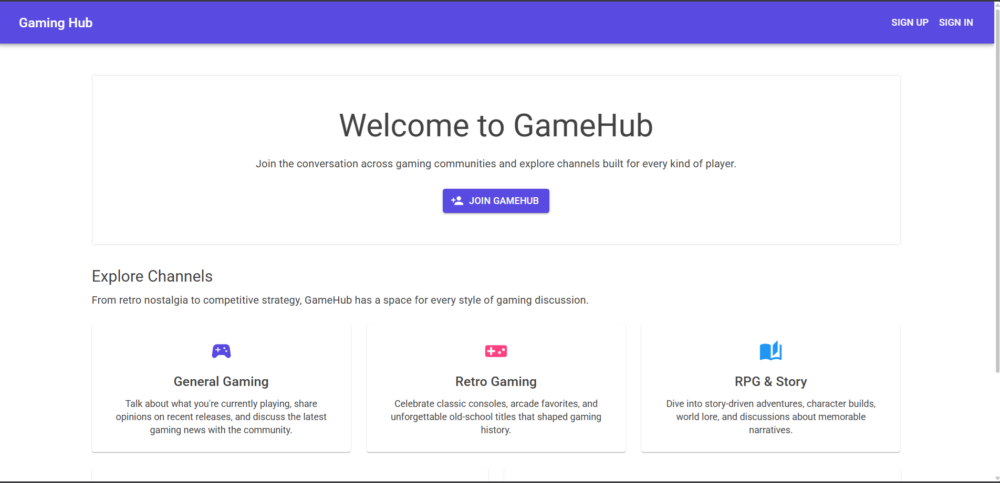
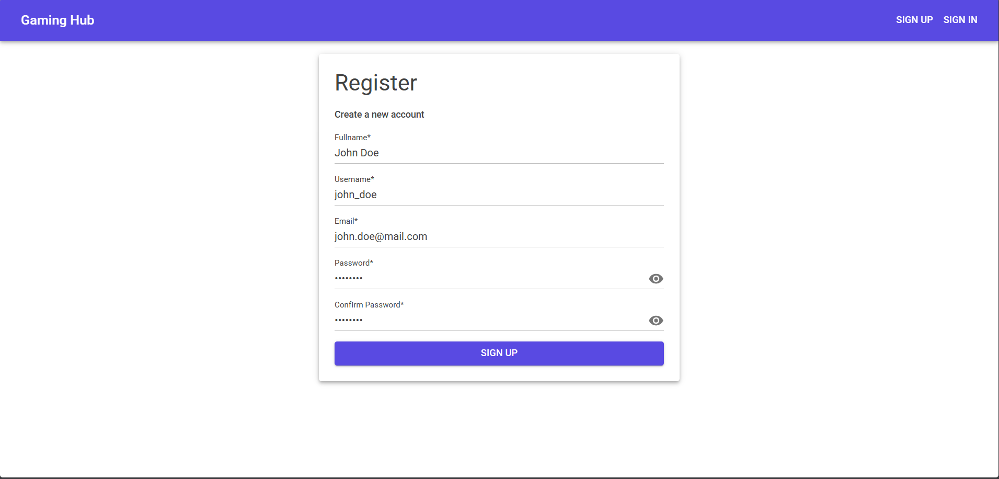
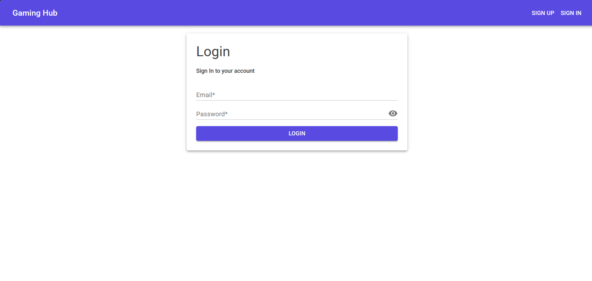
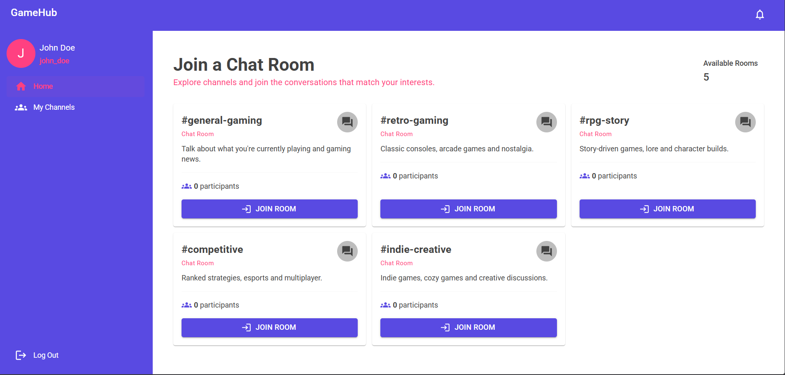
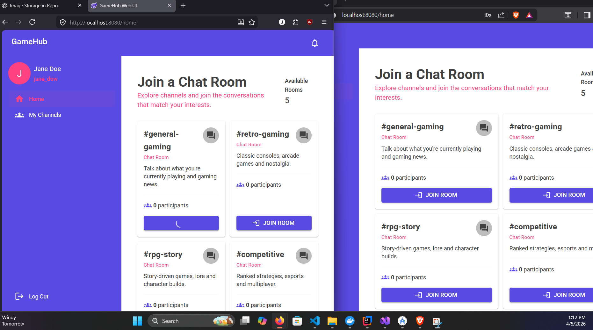
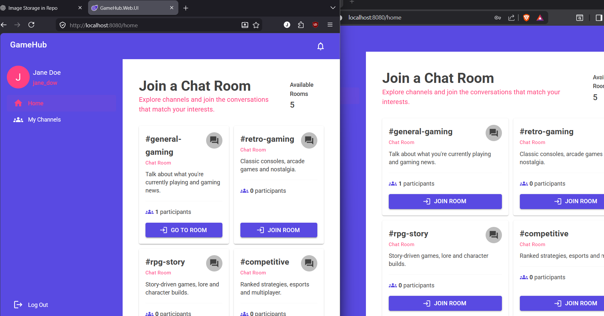
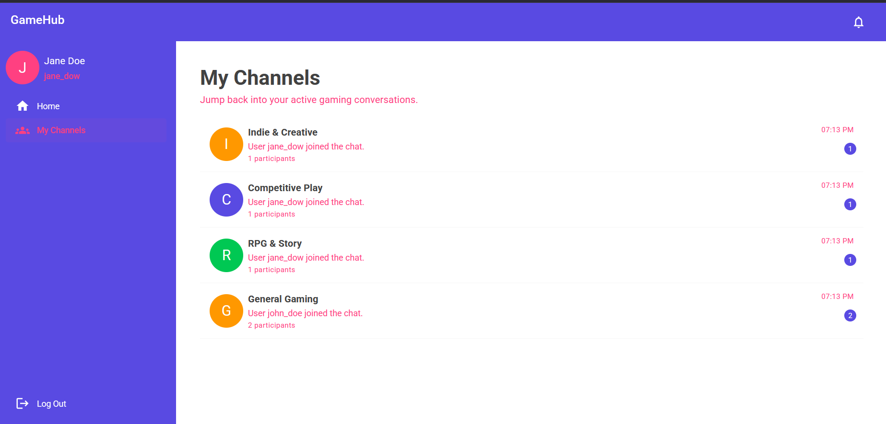
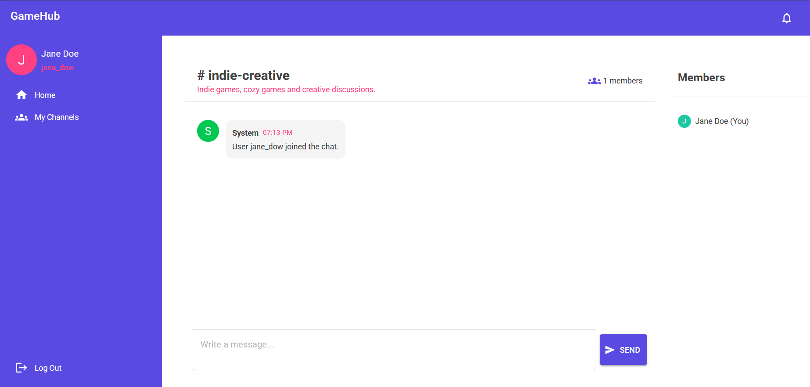
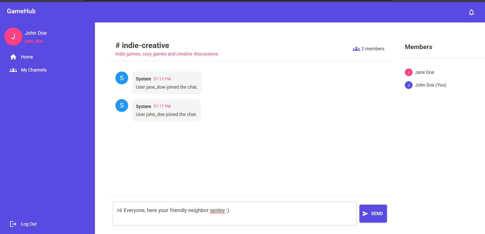
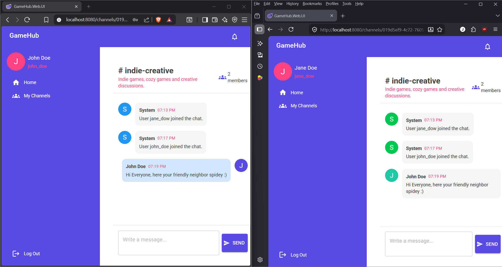

# GameHub

GameHub is a **real-time multi-channel chat application** built with **ASP.NET Core**, **Blazor WebAssembly**, **MudBlazor**, and **SignalR**, following **Clean Architecture** principles.

This project was built to showcase modern full-stack .NET development with a strong focus on **scalable backend design**, **real-time communication**, and a polished **single-page chat experience** on the frontend.

It highlights:

- Clean Architecture and separation of concerns
- CQRS-style application layer organization
- JWT-based authentication
- Real-time messaging with SignalR
- Cursor-based pagination for efficient message loading
- Infinite scroll experience in Blazor WebAssembly
- Responsive UI built with MudBlazor
- Scalable messaging infrastructure with MassTransit + RabbitMQ
- Redis backplane support for SignalR scale-out
- Unit and integration testing with Testcontainers

---

## Screenshots

### Authentication




### Channels and Navigation




### Chat Experience





### Infinite Scroll and Messaging





## Tech Stack

### Backend
- ASP.NET Core Web API (.NET 9)
- Carter
- MediatR
- FluentValidation
- Entity Framework Core
- SQL Server
- ASP.NET Core Identity
- SignalR
- Redis
- MassTransit
- RabbitMQ

### Frontend
- Blazor WebAssembly (.NET 9)
- MudBlazor
- SignalR Client
- Infinite scroll for chat messages and participants
- Local storage for auth persistence

### Testing
- xUnit
- FluentAssertions
- Moq
- MockQueryable
- Microsoft.AspNetCore.Mvc.Testing
- Testcontainers
- Respawn

---

## Solution Structure

```text
GameHub.sln
│
├── apps
│   ├── GameHub.WebAPI
│   └── GameHub.Web.UI
│
├── src
│   ├── GameHub.Domain
│   ├── GameHub.Application
│   ├── GameHub.Infrastructure
│   ├── GameHub.Contracts
│   ├── GameHub.Abstractions
│   └── GameHub.EventBus.Contracts
│
└── tests
    ├── GameHub.Domain.UnitTests
    ├── GameHub.Application.UnitTests
    └── GameHub.WebAPI.IntegrationTests
