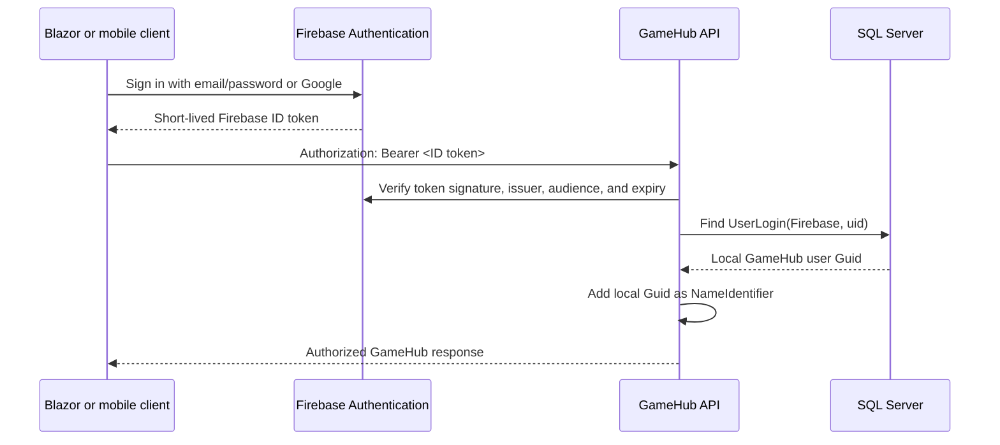

# Firebase Authentication plan for GameHub

This document proposes how to replace GameHub's password and JWT issuance flow with Firebase Authentication while preserving the application's existing domain model, authorization rules, and Clean Architecture boundaries. It is an implementation plan only; no application code or configuration is changed by this document.

## Decision

Use Firebase Authentication for email/password and Google sign-in. Clients authenticate with Firebase and send a Firebase ID token to GameHub as a bearer token. The API verifies that token, maps its Firebase user ID (`uid`) to GameHub's existing local `Guid` user ID, and continues to use the local `Guid` for profiles, chats, messages, presence, and authorization.

Keep a local GameHub user record. Firebase should own credentials and provider accounts; SQL Server should continue to own GameHub profile data and all application relationships.

Do not change the domain user keys from `Guid` to Firebase's string `uid`. That would require a broad migration of `UserProfile`, `ChatMember`, `ChatMessage`, `UserChat`, `UserPresence`, seeded data, events, queries, and tests for no product benefit.

Use the existing ASP.NET Identity `UserLogins` table as the identity link:

| Field | Value |
| --- | --- |
| `LoginProvider` | `Firebase` |
| `ProviderKey` | Firebase `uid` |
| Local user key | Existing `ApplicationUser.Id` (`Guid`) |

This avoids adding a second identifier to domain entities and may avoid a schema migration because `ApplicationDbContext` already inherits from `IdentityDbContext`. Confirm the generated model and uniqueness constraints before implementation. A dedicated `ExternalIdentity` entity would only be preferable if GameHub later needs provider-specific metadata, audit history, or multiple identity tenants beyond what `UserLogins` can represent.

## Why the current flow cannot accept Firebase tokens unchanged

Today the authentication path is:

1. The Blazor UI posts an email and password to `POST /api/identity/auth`.
2. `IdentityService` checks the password with ASP.NET Identity.
3. `JwtProvider` issues a GameHub HMAC JWT whose `sub` is the local user's `Guid`.
4. The UI stores that JWT under `token`, parses it to build its authentication state, and attaches it to API and SignalR requests.
5. `AuthenticatedUserService` reads `ClaimTypes.NameIdentifier` and parses it as a `Guid`.

The relevant files are:

- [`IdentityService.cs`](../../src/GameHub.Infrastructure/Identity/IdentityService.cs)
- [`JwtProvider.cs`](../../src/GameHub.Infrastructure/Authentication/Jwt/JwtProvider.cs)
- [`ServiceCollectionExtensions.cs`](../../apps/GameHub.Web.API/Extensions/ServiceCollectionExtensions.cs)
- [`AuthenticatedUserService.cs`](../../src/GameHub.Infrastructure/Authentication/AuthenticatedUserService.cs)
- [`AuthService.cs`](../../apps/GameHub.Web.UI/Features/Auth/Services/AuthService.cs)
- [`JwtAuthenticationStateProvider.cs`](../../apps/GameHub.Web.UI/Features/Auth/State/JwtAuthenticationStateProvider.cs)
- [`AuthorizationInterceptor.cs`](../../apps/GameHub.Web.UI/Infrastructure/Http/AuthorizationInterceptor.cs)
- [`HubExtensions.cs`](../../apps/GameHub.Web.UI/Shared/Extensions/HubExtensions.cs)

A Firebase ID token has a Firebase string `uid` in `sub`, not a GameHub `Guid`. It also does not contain GameHub's username or local profile ID. Replacing the signing configuration alone would therefore make `AuthenticatedUserService` fail and would break UI code that parses `sub` with `Guid.Parse`.

## Target flow



For a new Firebase account, the identity link does not exist yet. The API should recognize the caller as Firebase-authenticated but not yet onboarded. An onboarding endpoint then creates the local `ApplicationUser`, `UserProfile`, and `UserPresence`, adds the `UserLogin` mapping, and returns the local profile.

## Responsibilities by layer

### Blazor WebAssembly

Use the official modular Firebase JavaScript SDK through a small JavaScript interop module. This is preferable to making a third-party .NET wrapper part of the authentication boundary.

The module should expose operations such as:

- initialize Firebase exactly once;
- create an email/password account;
- sign in with email/password;
- sign in with Google using redirect on mobile and either redirect or popup on desktop;
- observe `onIdTokenChanged` so Blazor learns about sign-in, sign-out, and token refresh;
- return `getIdToken()` for API and SignalR requests;
- send an email-verification message;
- sign out.

Use Firebase persistence rather than copying ID and refresh tokens into the current custom local-storage entry. The UI authentication-state provider may decode the ID token for display/navigation state, but decoded client claims are never an authorization decision.

Replace the current token interceptor behavior with an asynchronous Firebase token provider. Before an API call, obtain the current ID token and attach it as `Authorization: Bearer ...`. If an API call returns `401`, force one token refresh and retry once; if that still fails, sign out and return to the login page. Do not create an infinite retry loop.

SignalR must also request a current token rather than capture an old token. Its `AccessTokenProvider` should call the same asynchronous token provider each time SignalR connects or reconnects. The API must retain the current behavior that reads `access_token` from the query string only for `/hubs` requests.

The current UI builds `UserDetails` from GameHub-specific JWT claims. With Firebase, load this data from a protected `GET /api/identity/me` endpoint because username, full name, and the local `Guid` belong to GameHub rather than Firebase's authorization token.

### API authentication

Add a Firebase authentication scheme in the API composition root. A custom ASP.NET Core authentication handler can:

1. Read the bearer token, including SignalR's `access_token` query parameter for hub requests.
2. Verify it through an Infrastructure abstraction backed by `FirebaseAuth.VerifyIdTokenAsync` from the Firebase Admin .NET SDK.
3. Create claims for the verified Firebase `uid`, email, email-verification state, and sign-in provider.
4. Resolve `UserLogin("Firebase", uid)` through `UserManager<ApplicationUser>`.
5. When a mapping exists, add the local `ApplicationUser.Id` as `ClaimTypes.NameIdentifier`.

Keep the Firebase Admin SDK and its concrete verifier in Infrastructure. Keep authentication registration in the API because it is the composition root. Application and Domain should not reference Firebase packages.

Use two authorization policies:

| Policy | Requirement | Usage |
| --- | --- | --- |
| `FirebaseAuthenticated` | Valid Firebase token | onboarding and current-user discovery |
| `GameHubUser` | Valid Firebase token plus a mapped local `Guid` | all chats, channels, presence, and SignalR operations |

Make `GameHubUser` the default policy so existing `.RequireAuthorization()` endpoints and `[Authorize]` on `ChatHub` remain protected against authenticated-but-unmapped Firebase accounts. Apply `FirebaseAuthenticated` explicitly to onboarding endpoints.

`AuthenticatedUserService` can keep returning a `Guid` from `ClaimTypes.NameIdentifier`. It should fail clearly when the required claim is absent or malformed rather than silently returning `Guid.Empty`; the `GameHubUser` policy should normally prevent that state from reaching an application handler.

Firebase token verification authenticates the caller. Existing handlers must still authorize chat membership and other resource access independently.

### Local account onboarding

Replace public password registration with an idempotent endpoint such as:

```text
POST /api/identity/profile
Authorization: Bearer <Firebase ID token>

{
  "username": "player_one",
  "fullname": "Player One"
}
```

The endpoint should use the verified token's `uid` and email. It must not accept a Firebase `uid`, local user ID, or authoritative email from the request body.

The onboarding use case should:

1. Return the existing local profile when the Firebase `uid` is already linked, making retries safe.
2. Require a non-empty, verified email according to the product's chosen verification policy.
3. Reject an email already owned by a different local user unless the caller is completing an explicit, proof-based account-linking flow.
4. Validate and reserve the GameHub username using the existing uniqueness rules.
5. Create an `ApplicationUser` without a local password, using a new version-7 `Guid`.
6. Add `UserLoginInfo("Firebase", uid, "Firebase")` to the user.
7. Create `UserProfile`; its constructor also creates `UserPresence`.
8. Commit the identity record, provider link, profile, and presence in one SQL transaction using the shared `ApplicationDbContext`.
9. Return `UserDetails` or the equivalent shared contract.

Concurrent duplicate requests must be handled by database uniqueness, followed by a re-read that returns the already-created profile when the same `uid` won the race. A username or email owned by a different account should return a stable conflict error.

Suggested contracts are:

- `CreateCurrentUserRequest(string Username, string Fullname)`;
- `CurrentUserResponse(Guid Id, string Email, string Username, string Fullname)`;
- stable errors such as `Identity.ProfileRequired`, `Identity.EmailNotVerified`, `Identity.EmailAlreadyLinked`, and `Identity.UsernameAlreadyExists`.

`GET /api/identity/me` should require `FirebaseAuthenticated`. It can return the linked profile or `404`/`409` with `Identity.ProfileRequired`; choose one response and keep the UI and OpenAPI contract aligned.

### Email/password registration

The client flow should be:

1. Call Firebase `createUserWithEmailAndPassword`.
2. Update the Firebase display name if desired; do not treat it as the canonical GameHub profile.
3. Send email verification.
4. After the user verifies, force-refresh the ID token so `email_verified` is current.
5. Call the idempotent GameHub profile endpoint with username and full name.
6. Load `/api/identity/me`, update Blazor authentication state, and enter the app.

If profile creation fails because the username is taken, keep the Firebase session and let the user choose another username. Do not delete the Firebase user automatically: the account may have existed before this attempt, and automatic deletion can lose access to a valid identity.

Requiring verified email before creating a local profile is recommended. If early product testing intentionally permits unverified email, record that as a temporary policy and prevent email-based account linking until verification succeeds.

### Google sign-in

Enable Google in Firebase Authentication and use `GoogleAuthProvider`. Redirect is preferred for mobile browsers; popup can remain a desktop option.

After Firebase sign-in:

- an already linked `uid` proceeds directly to `/api/identity/me`;
- a new `uid` enters the same GameHub profile-onboarding flow;
- the Google display name may prefill `fullname`, but the user must still choose a unique GameHub username;
- a local email collision must enter an explicit linking or recovery flow, never silently attach by matching email.

Firebase can link password and Google credentials to one Firebase account so both methods retain the same `uid`. Implement and test provider-linking errors, especially `auth/account-exists-with-different-credential`, rather than creating two GameHub profiles.

## Configuration and secrets

Create separate Firebase projects for development/test and production, or at minimum separate Firebase applications with a clearly controlled environment strategy. Enable Email/Password and Google providers and configure authorized domains for every UI origin.

Client configuration belongs in the Blazor public configuration and may contain Firebase's web values:

```json
{
  "Firebase": {
    "ApiKey": "...",
    "AuthDomain": "<project-id>.firebaseapp.com",
    "ProjectId": "<project-id>",
    "AppId": "..."
  }
}
```

Firebase web configuration identifies the Firebase project; it is not an Admin credential. API keys should still be restricted as Firebase recommends.

Server configuration needs the Firebase project ID and Application Default Credentials. In a non-Google hosting environment, provide a service-account JSON file through a secret store and set `GOOGLE_APPLICATION_CREDENTIALS` to its mounted path. Never commit the service-account JSON, private key, ID tokens, or refresh tokens, and never place Admin credentials in `wwwroot` or a client image.

For local development, use the Firebase Authentication emulator where practical:

```text
FIREBASE_AUTH_EMULATOR_HOST=127.0.0.1:9099
```

The value intentionally has no `http://` prefix. Set it only in development/test; the Admin SDK accepts unsigned emulator tokens when this variable is present.

## Existing users and seeded accounts

Existing ASP.NET Identity password accounts do not automatically exist in Firebase. Choose and test a migration path before removing the old endpoints:

1. For disposable development data, recreate accounts in the Firebase emulator/project and add the `Firebase` login mappings to the corresponding seeded local users.
2. For real users, prefer a controlled linking flow. The user proves access through the old password flow or a verified recovery process, signs in to Firebase, and the server links that Firebase `uid` to the existing local `Guid`.
3. A forced Firebase password-reset enrollment is another safe option when preserving old passwords is unnecessary.

Do not link an existing local account merely because the Firebase token has the same email. Email matching alone can attach the wrong identity, especially if legacy email verification was not enforced.

The current production admin and development demo seeders create local passwords. After cutover those passwords will not authenticate through Firebase. Update the seeding strategy as part of implementation: keep local profiles for relational test data, and seed Firebase/emulator identities only in environment-specific setup. Never call the production Firebase project from ordinary integration tests.

## Token lifetime, logout, and revocation

Firebase ID tokens are short lived, currently about one hour, and Firebase refresh tokens are used by the client SDK to obtain new ID tokens. The UI should rely on the SDK's auth-state/token events and request a current token when needed.

Logout calls Firebase `signOut`, clears GameHub's in-memory authentication state, stops the SignalR connection, and navigates to login. The API remains stateless when bearer ID tokens are used.

Normal Admin SDK verification validates signature, issuer, audience, and expiry but does not check revocation unless requested. Checking revocation adds a remote lookup. Decide explicitly where immediate disable/revocation is required: a reasonable first version validates every token normally and performs revocation checks for sensitive account operations, while short token lifetime limits ordinary exposure. Document any stronger product requirement before applying a remote revocation check to every chat request.

## Implementation sequence

Implement this in stages so the application remains testable throughout:

1. Add Firebase project configuration, the Authentication emulator setup, and the Infrastructure token-verifier abstraction.
2. Add the API Firebase authentication scheme and the two authorization policies while retaining the legacy JWT scheme temporarily for migration tests.
3. Add idempotent profile onboarding and `GET /api/identity/me`, including the Firebase-to-local `UserLogin` mapping.
4. Add the Blazor JavaScript module, Firebase-backed authentication state, email/password pages, and Google sign-in.
5. Update the HTTP interceptor and SignalR `AccessTokenProvider` to retrieve fresh Firebase ID tokens asynchronously.
6. Migrate or deliberately recreate existing users and seeded accounts.
7. Switch protected API endpoints and the hub to the `GameHubUser` policy.
8. Remove the legacy `POST /api/identity/auth`, password registration, `JwtProvider`, `JwtOptions`, GameHub JWT configuration, and obsolete request/response contracts after all supported clients have moved.
9. Remove password-specific ASP.NET Identity services only after confirming they are not needed for local user/login management, roles, seeding, or migration. Keeping `UserManager` and Identity's EF stores does not mean GameHub still owns user passwords.

During the transition, give Firebase and legacy JWTs distinct authentication scheme names. Never configure both issuers under one permissive validation rule.

## Verification plan

Unit and integration coverage should include:

- valid Firebase token resolves the correct local `Guid` claim;
- invalid signature, wrong audience/project, expired token, and malformed token return `401`;
- authenticated but unlinked Firebase users cannot access chats, channels, presence, or the hub;
- onboarding creates exactly one `ApplicationUser`, `UserLogin`, `UserProfile`, and `UserPresence`;
- repeated and concurrent onboarding requests are idempotent;
- username and email collisions return stable ProblemDetails codes;
- request email or user ID values cannot override verified token claims;
- unverified email follows the selected policy;
- email/password and Google credentials linked to one Firebase account resolve to one GameHub user;
- HTTP requests and SignalR reconnects obtain refreshed tokens;
- resource authorization still rejects a valid user who is not a member of the requested chat;
- logout clears UI state and stops authenticated hub activity;
- existing account migration cannot link by unverified email alone.

Keep normal API integration tests deterministic by replacing the Firebase verifier with a test implementation that returns controlled verified identities. Add a smaller end-to-end suite against the Firebase Authentication emulator for client sign-in, token issuance, and server verification. Ensure the test host never inherits production Firebase credentials or points at a production project.

No database migration should be assumed until the existing `UserLogins` approach is validated against the current EF model. If a migration is needed, review it separately and test it on a disposable SQL Server database; the current integration fixture uses `EnsureCreatedAsync` and does not prove migration safety.

## Firebase references

- [Get started with Firebase Authentication on websites](https://firebase.google.com/docs/auth/web/start)
- [Email and password authentication for web](https://firebase.google.com/docs/auth/web/password-auth)
- [Google authentication for web](https://firebase.google.com/docs/auth/web/google-signin)
- [Link multiple authentication providers](https://firebase.google.com/docs/auth/web/account-linking)
- [Verify Firebase ID tokens on a server](https://firebase.google.com/docs/auth/admin/verify-id-tokens)
- [Set up the Firebase Admin SDK](https://firebase.google.com/docs/admin/setup)
- [Manage Firebase sessions and token revocation](https://firebase.google.com/docs/auth/admin/manage-sessions)
- [Connect to the Authentication emulator](https://firebase.google.com/docs/emulator-suite/connect_auth)

