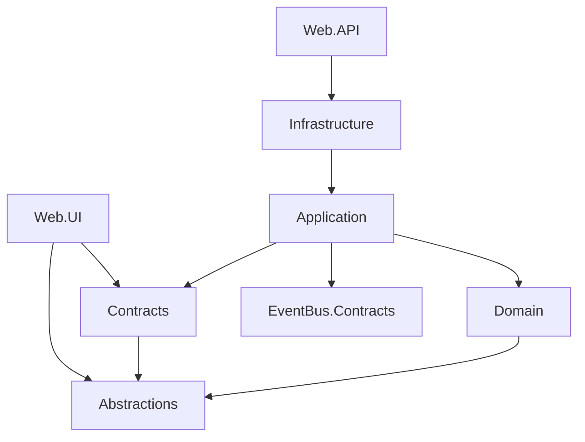

# GameHub reference implementation

Inspected: 2026-09-21, including the existing working-tree changes. This map documents what the code does; the [shared standard](dotnet-standard.md) defines expectations for future work. Paths below are evidence, not a claim that all code is a finished company template.

## Actual project references

Arrows mean a direct project reference, not request execution order. This corrects the ambiguity in the README's high-level layer diagram: Domain does not reference Infrastructure.

Evidence: the `.csproj` files in each project. All eleven projects, including tests, target `net9.0`; there is no `global.json` pinning SDK selection. The host's installed SDK version is a separate fact from the target framework.

## Stack and code to read first

| Concern | Observed implementation | Evidence |
| --- | --- | --- |
| HTTP | Carter 8.2.1, Minimal APIs, OpenAPI | [API project](../../apps/GameHub.Web.API/GameHub.Web.API.csproj), [send endpoint](../../apps/GameHub.Web.API/Endpoints/Chats/SendMessage.cs) |
| CQRS | MediatR 12.3.0, nested partial feature types | [send request](../../src/GameHub.Application/Features/Chats/Commands/SendMessage/Command.cs), [handler](../../src/GameHub.Application/Features/Chats/Commands/SendMessage/Handler.cs) |
| Validation | FluentValidation 12.1.1; Logging then Validation behavior | [registration](../../src/GameHub.Application/DependencyInjection.cs), [behavior](../../src/GameHub.Application/Abstractions/Behaviors/ValidationBehavior.cs) |
| Persistence | EF Core 9.0.13, SQL Server, IdentityDbContext | [context port](../../src/GameHub.Application/Abstractions/Data/IApplicationDbContext.cs), [context](../../src/GameHub.Infrastructure/Data/ApplicationDbContext.cs) |
| Mapping | Explicit query projections; AutoMapper 16.1.1 reference/helpers also exist | [message projection](../../src/GameHub.Application/Features/Chats/Queries/GetMessages/Projections.cs), [mapping helpers](../../src/GameHub.Application/Extensions/MappingExtensions.cs) |
| Messaging | MassTransit 8.5.8, RabbitMQ, EF bus and consumer outbox | [Infrastructure registration](../../src/GameHub.Infrastructure/DependencyInjection.cs), [consumer](../../src/GameHub.Application/Features/Chats/Consumers/ChatMessageSentConsumer.cs) |
| UI | Blazor WebAssembly, MudBlazor 9.2.0, SignalR client | [UI project](../../apps/GameHub.Web.UI/GameHub.Web.UI.csproj), [UI startup](../../apps/GameHub.Web.UI/Program.cs) |
| Integration tests | WebApplicationFactory, SQL Server/Redis Testcontainers, Respawn, MassTransit harness | [test factory](../../tests/GameHub.Web.API.IntegrationTests/Abstractions/CustomWebApplicationFactory.cs) |

Versions are an inventory, not upgrade recommendations. Recheck the projects before copying package versions to another application.

## A real feature walkthrough

For sending a message, the Carter endpoint receives `ChatSendMessage.Command` and dispatches it through MediatR. The handler loads the chat and current user profile, checks membership, obtains UTC time from `IDateTimeProvider`, and calls `Chat.AddMessage`. The domain method checks content limits and updates message/preview state. The handler publishes `ChatMessageSentEvent` through the scoped publish endpoint, saves the context, and returns a `MessageDto`.

Infrastructure configures the EF bus outbox and RabbitMQ delivery. `ChatMessageSentConsumer` retrieves the DTO through a query and calls `IMessageSentNotifier`; the Infrastructure implementation handles SignalR. These runtime steps are different from compile-time dependencies in the diagram.

For a read path, [GetMessagesByChat](../../src/GameHub.Application/Features/Chats/Queries/GetMessages/Handler.cs) uses `AsNoTracking`, sorts by creation time then ID, projects to DTOs, and requests one extra row to determine the next cursor. Use this as a structural reference while reviewing authorization and validation requirements for the specific use case.

## Facts that must not become accidental company rules

| Observation | Consequence for new work |
| --- | --- |
| `ValidationBehavior` is constrained to `IBaseCommand`; query validators exist but the inspected query handlers/endpoints do not invoke them | Verify validation through the actual dispatch path. Do not claim all queries are validated. |
| Existing uncommitted API changes emit ProblemDetails through `ToProblem`; UI services still deserialize `Error` in several paths | Treat API/client error compatibility as unfinished work. Coordinate any migration and test both ends. |
| Domain returns Result for business errors; the validation pipeline throws an application validation exception | Preserve both boundaries; do not copy a blanket prohibition on exceptions. |
| AutoMapper is referenced with helper methods, while inspected feature queries use explicit projections | Prefer the demonstrated projection style without claiming AutoMapper is absent or globally forbidden. |
| API startup applies migrations in Development/Docker and seeds outside IntegrationTesting | Running the host has database side effects. Check the environment and target first. |
| Integration fixture uses `EnsureCreatedAsync`, a test harness, and relaxed JWT checks | Green tests alone do not establish migration correctness, production RabbitMQ/outbox behavior, or strict JWT validation. |
| Some sample/system-user credentials and development-oriented auth settings exist | Do not copy credentials or relaxed defaults into the shared standard. Review deployment-specific security separately. |
| No tracked `.editorconfig`, `global.json`, or CI workflow was found | Markdown does not create these controls. Their adoption is separate work. |
| No dedicated UI test project is present | Be explicit about build checks and manual UI verification. |

This documentation change does not fix those code gaps or certify production readiness. Revisit the table as the underlying changes are completed.
